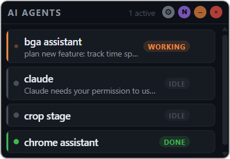

[Home](..) | [Claude Code](claude-code) | [Other Tools](other-tools) | [Development](development)

---

The widget tracks [Claude Code](https://claude.com/product/claude-code) sessions by registering as Claude Code hooks. Each session becomes a row in the dashboard, named after its working directory (e.g. a session started in `D:/projects/ai-agent-dashboard` shows up as `ai-agent-dashboard`).

### How sessions appear

A fresh Claude Code session shows as `idle` the moment you launch it. The moment you submit a prompt it flips to `working` with the first 60 characters of your prompt as the row's label. When Claude finishes responding, the row marks `done`. When you `/exit`, the row is cleared. If Claude hits a permission prompt mid-response, the row shows `idle` until you answer — then returns to `working` automatically.



### Setup

Add these five hooks to `~/.claude/settings.json` (merge with any existing `hooks` block). Replace `<repo>` with the absolute path to your clone.

```json
{
  "hooks": {
    "SessionStart": [
      { "hooks": [ { "type": "command", "async": true,
          "command": "python3 <repo>/integrations/claude_hook.py idle" } ] }
    ],
    "UserPromptSubmit": [
      { "hooks": [ { "type": "command", "async": true,
          "command": "python3 <repo>/integrations/claude_hook.py working" } ] }
    ],
    "Notification": [
      { "hooks": [ { "type": "command", "async": true,
          "command": "python3 <repo>/integrations/claude_hook.py idle" } ] }
    ],
    "Stop": [
      { "hooks": [ { "type": "command", "async": true,
          "command": "python3 <repo>/integrations/claude_hook.py done" } ] }
    ],
    "SessionEnd": [
      { "hooks": [ { "type": "command", "async": true,
          "command": "python3 <repo>/integrations/claude_hook.py clear" } ] }
    ]
  }
}
```

Restart any open Claude Code sessions — hooks are loaded at session start, so existing sessions stay silent until relaunched.

Requires Python 3 on PATH (the hook is a Python script).

### Optional: MCP server

Hooks cover the main lifecycle reliably (start / prompt / stop / notification / end). If you want Claude to signal additional states like `thinking` or `error` mid-response, register the MCP server as well:

```bash
claude mcp add --scope user claude-status node <repo>/src/server.js
```

The MCP tool and the hooks converge on the same session row when the `cwd` matches — no duplicate entries. All MCP calls log to `mcp.log` at the repo root for post-hoc inspection.

### Live state tracking

Beyond the hook-driven transitions, the widget watches the Claude Code transcript JSONL file for the active session and updates state when new conversational entries appear. This catches cases hooks don't observe:

- Long tool loops where the hook fires once but activity continues for a while.
- Resumption after a permission prompt — as soon as Claude writes a new tool use or text block, the row flips back to `working`.
- Intermediate reasoning steps.

Transcripts are read-only — the widget never writes to them. If parsing fails (unknown entry shape, unreadable file), the widget surfaces a red `watcher-error` row with the failure reason and writes a JSON-lines entry to `widget.log`. Never silent.

### Readable session names

Claude Code sessions are identified by their working directory's basename. For projects nested under a common root, set `projects_root` in `config/config.json` to get human-readable names:

```json
{ "projects_root": "d:/projects" }
```

With that, a session in `d:/projects/bga/assistant` shows up as `bga assistant` rather than just `assistant`. Slashes, dashes, and underscores in the relative path all become spaces.

### Features

- **Five lifecycle hooks**: SessionStart → idle, UserPromptSubmit → working, Notification → idle, Stop → done, SessionEnd → clear.
- **Transcript watcher**: tails `~/.claude/projects/<project>/<session>.jsonl` and infers state from the last conversational entry (tool_use / tool_result → working; assistant text → done).
- **Prompt-as-label**: first line of your prompt (≤60 chars) displays under the session name while `working`.
- **Readable session IDs**: cwd basename by default, subpath-under-`projects_root` if configured.
- **Optional MCP escape hatch**: for mid-response state changes (`thinking`, `error`) that hooks don't observe.
- **Loud-but-not-silent error surface**: transcript parse failures show as a red row plus a line in `widget.log`, so missed state is never invisible.

### Standard features

- **Desktop notifications** on done/error transitions (toggleable via the `N` button).
- **Always on top** by default, toggleable from the Settings tab.
- **Configurable position**: four corners, chosen from the Settings tab or the tray right-click menu.
- **System tray icon**: click to show/hide, right-click for position menu and quit.
- **Auto-dismiss done sessions**: toggleable from Settings — done rows fade out after 30 s.
- **Auto-reconnect renderer**: the widget's UI reconnects to the HTTP hub on network blip with exponential backoff.
